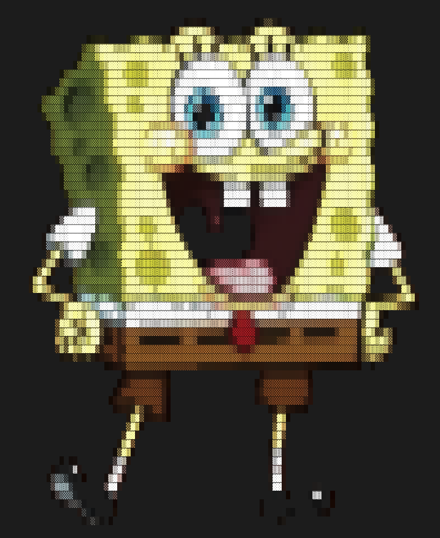

# image_to_ascii: Terminal Image to ASCII/Unicode Art Converter

[](https://www.rust-lang.org/) [](LICENSE) [](#)

A fast and colorful Rust CLI tool to convert images into ASCII or Unicode art directly in your terminal!

## Example: Convert an Image to Colorful ASCII Art

<table>
<tr>
<td align="center"><b>Input Image</b><br></td>
<td align="center"><b>ASCII Output (screenshot)</b><br></td>
</tr>
</table>

### Example Command

```sh
cargo run --release -- -i assets/index.png -w 100 -m blocks -b -c 1.2
```

## Features

- Supports multiple ASCII/Unicode palettes (blocks, bubbles, geometric, ascii)
- Colorful output using truecolor (with optional colored background)
- Adjustable width, contrast, and inversion
- Handles transparency and dark backgrounds
- Fast image resizing and rendering

## Installation

1. **Clone the repository:**
   ```sh
   git clone https://github.com/lukasmetzler/image_to_ascii.git
   cd image_to_ascii
   ```
2. **Build with Cargo:**
   ```sh
   cargo build --release
   ```
3. **Run:**
   ```sh
   cargo run --release -- --image path/to/image.png
   ```

## Usage

```
USAGE:
    image_to_ascii [OPTIONS] --image <IMAGE>

OPTIONS:
    -i, --image <IMAGE>         Path to the input image file (required)
    -m, --mode <MODE>           Output character set: ascii | blocks | bubbles | geometric [default: ascii]
    -n, --invert                Invert image colors (default: false)
    -w, --width <WIDTH>         Output width in characters (default: 100)
    -c, --contrast <CONTRAST>   Contrast adjustment factor (default: 1.0)
    -b, --background            Enable colored background (default: false)
    -h, --help                  Print help information
    -V, --version               Print version information
```

## Parameters

| Flag / Option        | Description                                                     | Default |
| -------------------- | --------------------------------------------------------------- | ------- |
| `-i`, `--image`      | Path to the input image file (**required**)                     |         |
| `-m`, `--mode`       | Output character set: `ascii`, `blocks`, `bubbles`, `geometric` | ascii   |
| `-n`, `--invert`     | Invert image colors                                             | false   |
| `-w`, `--width`      | Output width in characters                                      | 100     |
| `-c`, `--contrast`   | Contrast adjustment factor (float, e.g. 1.2 for more contrast)  | 1.0     |
| `-b`, `--background` | Enable colored background                                       | false   |

## Examples

- Basic usage:
  ```sh
  cargo run --release -- --image assets/index.png
  ```
- Use Unicode blocks and invert colors:
  ```sh
  cargo run --release -- --image assets/index.png --mode blocks --invert
  ```
- Set width and enable background:
  ```sh
  cargo run --release -- --image assets/index.png --width 80 --background
  ```
- Increase contrast:
  ```sh
  cargo run --release -- --image assets/index.png --contrast 1.5
  ```

## Palettes

- **ascii**: Standard ASCII characters (default)
- **blocks**: Unicode block elements
- **bubbles**: Unicode bubble/circle elements
- **geometric**: Unicode geometric shapes
